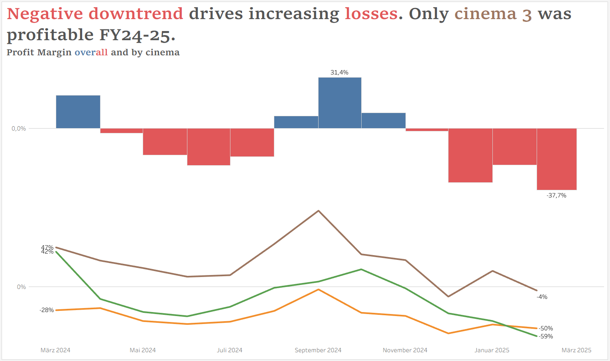
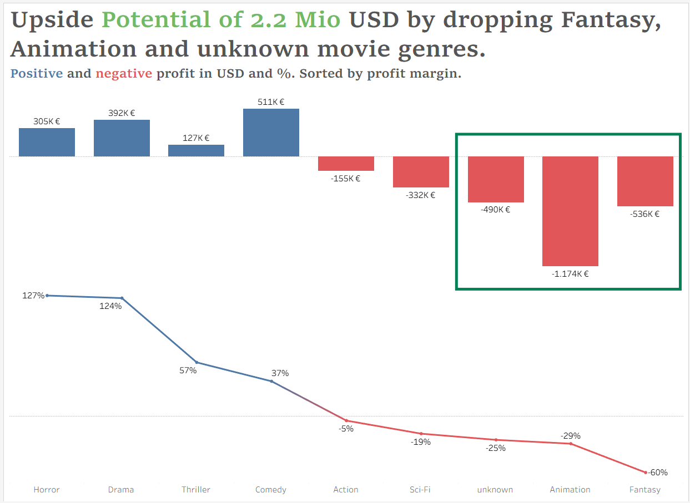
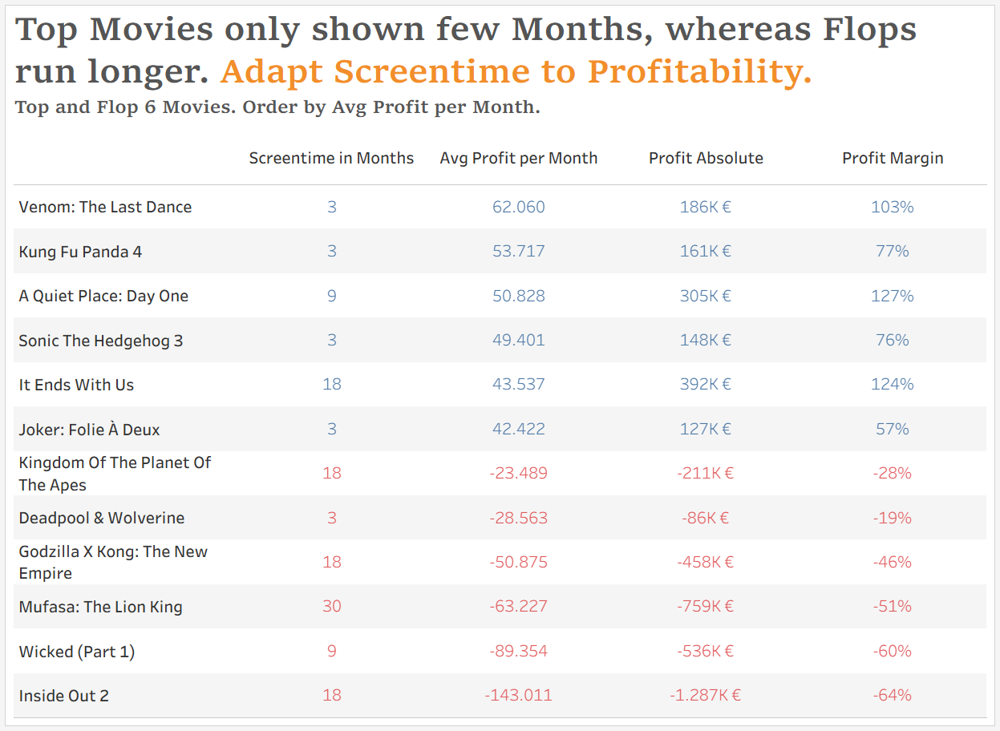
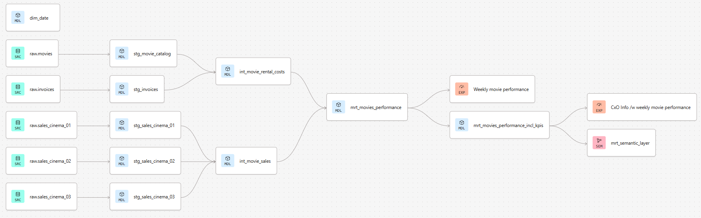

# ETL - Pipeline with dbt and Snowflake

## Project Purpose

This project is part of my curriculum at Masterschool. Main goal is to utilize the data built tool (dbt) for setting up, managing, testing and orchestration a data pipeline for a fictive movie theatre company. 

The pipeline producdes a dataset for assessing the performance of movies shown across all locations. The data is stored in a Snowflake datawarehouse.

> **For Masterschool auditors**: Access all required files on GitHub in respective folders. The lineage you will find down below as screenshot. The recording of my presentation was done via the last session, starting with min 16:40. [link](https://masterschool.zoom.us/rec/play/kNrXRGgVKZhn0br-BVpDS-hPzJMBY6by0hn1iKfbn6_5P8OUo5gftY0-FymXQ9ViHcWhrdl_fJEwDel-.RlhQQieAnFPLGYX-)

## Lessons Learned and Skills Built

**This project was - so far - one of the coolest ones!** 

`Snowflake` has enhanced SQL, ability to use SQL and Python, includes features which make initial EDA fast and easy, supports dashboards and comes with a buitiful UI. And dbt itself blew my mind. 

`dbt and Git` gave me the ability think and act like a Software developer. Having a version control, ability to break down 4 pages of SQL spaghetti into smaller pieces of code, visually seeing the lineage, creating and using macros, tests, unit-tests. And there is so much more to discover.

`Highlights`

* **designed a Medaillon data model** including multiple data models for transformation, cleaning and aggregation of data
* **writing macros** if as simple as functions in Python
* **implemented various data tests** as early as possible in the pipeline to safe guard data quality (from built-in tests, self-made custom tests, test packages like dbt_utils or dbt_expectations)
* **YAML and Jinja** make life so easy and your code DRY
* **documentation done while coding** but then magically extracted and put together by dbt in a structured and readable format

## Management Summary

### Insights for further discussion

`Key Message: The financial movie performance is not good!`

Overall, we are making losses in the analysed 12 months. This is due to a general downwards trend of profits and driven by movie theatres 1 and 2 (green and orange).

A closer look on the movie genres shows that some genres are not profitable at all. Three genres together create xx% of losses. Need to discuss reasons for the movies to be shown.

Finally, the data shows that unprofitable movies were shown very long, up to 18 months. This is confusing, because profitable movies were generally only for a couple months on the screen. 

Link to [Tableau Dashboard](https://public.tableau.com/app/profile/thorsten.weber/viz/movie_performance_FY24-25)

### Recommendations and next steps

Based on these insights and the underlying data analysis following aspects are worth considering:

#### Business aspects

* **Investigate downtrend** - investigate reasons 
    e.g. economical, wrong movie choice, bad CSAT?
* **Focus on profitable movie genres** and eliminate unprofitable ones
* **Show profitable movies longer** and reduce screening time for unprofitable ones

#### Next analysis 
* **Include cross-selling revenue** of food, drinks, merchandise as they could have bigger impact on profitability of movies in general, also consider infrastructure costs of movie theatre to get a complete picture 

#### Data quality

* **standardise reporting** across cinemans (fields, aggregation level)
* enforce filling in fields about movies when entering the data
* **include timestamp per source** dataset showing the reporting time and being used for data freshness checks
* **Measures to reduce duplicates** and missing invoices   

## Technical project description

The next passages are for the technical interested readers. You will find information about the data tools involved, steps and methods for data cleaning and transformation and testing of the models.

### Setup/ Tooling

This is not spectactular but technical setup is of course required
* Created new Snowflake environment
    * database and different schemas for development and production 
    * data storage for staging of raw data
    * data type for import of the csv files
* Created new dbt account in dbt cloud
    * connection to Snowflake
    * setting up two environments for dev and prod
    * integration with Github for version control
    * added test packages (dbt-utils, dbt-expectations)

This time I decided to work cloud native instead of dbt core local. I want to make use of the great data analysis features which are built in Snowflake for the EDA part of this project.

### Exploring the data

Within the initial exploratory data analysis (EDA) first anomalies showed already. Overall following anomalies exist. Many of them could be healed by different methods.

* missing values in various qualitative but also in numeric fields
* records for which no matching data can be found in others tables
* fully and partly duplicated data in invoices
* significantly high costs which cannot be compensated by revenue and create high losses

The methods for healing nearly of all them are described later in the paragraphs regarding the models and transformation and cleaning applied. Note: high costs cannot be healed. The reason needs to be investigated further.

### ETL-Pipeline: Ingestion in Snowflake

**The phase covers** a great feature of snowflake to directly connect to cloud storage providers and read in source files in various formats like csv or parquet. As this is the typical real-life scenario and we were given 5 CSV files I chose to simulate the cloud storage ingestion process, created a snowflake managed cloud storage and uploaded the csv files.

**Steps**:
* Identify columns required 
* DDL scripts to create schema `raw` as well as five `tables`
* Normalize and standardise column names and table names
* Use COPY INTO scripts to upload selected columns into tables

[code.sql](models/ingestation/load_raw_data.sql)

**Tests** applied: 
* not_null
* custom not_negative for tickets_sold, revenue and costs data
* custom test for accessing if date columns hold recent values
* unique test for movie_ids in movies source
* check for primary keys and foreign keys consistency across sources

### Transformation process using dbt

Use this lineage as a reference to better understand how the detailed models work together.

#### ETL-Pipeline: Staging 

The phase covers basic data type conversions and cleaning By convention there are no big transformations in this step. 

Applied **transformations and cleaning**:
* `stg_sales_cinema_01 and stg_sales_cinema_02`:
    * aggregate data on a monthly granularity
    * added feature to identify from which cinema the sales data comes from
* `stg_sales_cinema_03`:
    * data is already on monthly granularity. To safeguard the pipline still aggregation is applied if cinema three delivers data on daily level in the future
* `stg_movies`:
    * trim and initcap or upper for string columns for data quality
    * imputation of missing values with 'unknown' for string columns
    * identified missing values in movies_lenght not imputed, remains NULL in that case
* `stg_invoices`:
    * eliminated redundant invoice information
    * also applied trim and initcap for string columns
    * applied date_trunc(MONTH, ..) for invoice_date columns to prepare for monthly aggregation
    * extracted numeric values out of string columns (i.e. movie_budget and cinema_id)

**Tests** applied: Mainly not_null, a custom not_negative test and a custom test for accessing if date columns hold recent values. Additionally applied accepted_values for checken on correct cinema_ids.

#### ETL-Pipeline: Integration

* `int_movie_rental_costs`: Unioned all sales data from different movie theatres into one table.
* `int_movie_sales`: Joined invoice data with qualitative movie information from stg_movies

**Tests** applied: No tests applied due to data is not changed.

#### ETL-Pipeline: Consumer

Two models exist for the reason that both differ in granularity. One model has time-series data. The other model aggregates data on movie and cinema presenting KPIs to assess and compare the movies performance like avg_tickets_sold, total_profit and more.

* `mrt_movies_performance`: time-series data on monthly level
    * used full outer join for models int_movie_rental_costs with int_movie_sales
    * imputed missing values in int_movie_rental_costs with information from previous month information
    * added features screening_months_count and screening_duration_in_months required in later models
* `mrt_movies_performance_incl_kpis`: aggregated on movie and cinema
    * added features *first_month_on_screen*, calculated *total_brutto_profit* (i.e. revenue - rental_costs before infrastructure and personal)
    * added additional kpis for better movie performance comparison:
        * tickets_sold_per_month
        * movie_rental_costs_per_month
        * avg_brutto_profit
        * brutto_profit_percent (which is kind or a ROI)

**Tests** applied: Mainly not_null, not_negative or accepted_values on all fields to safeguard data quality at mart level.