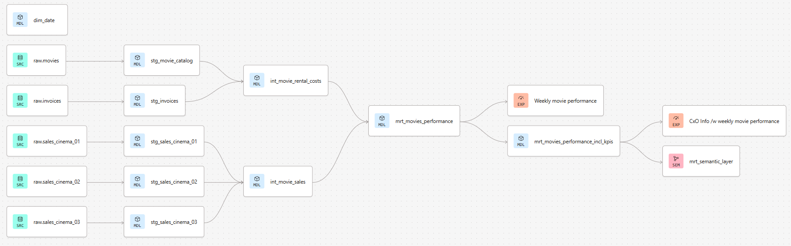
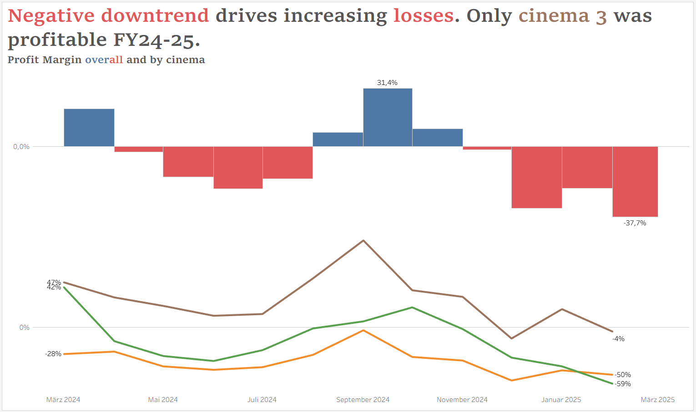
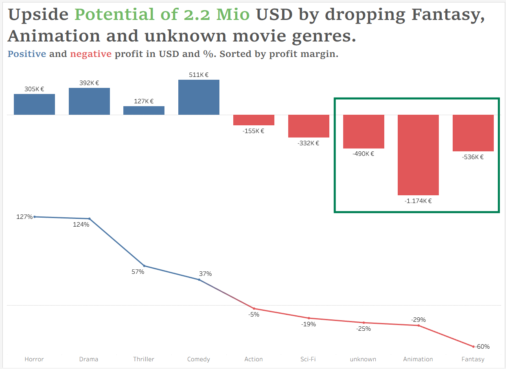
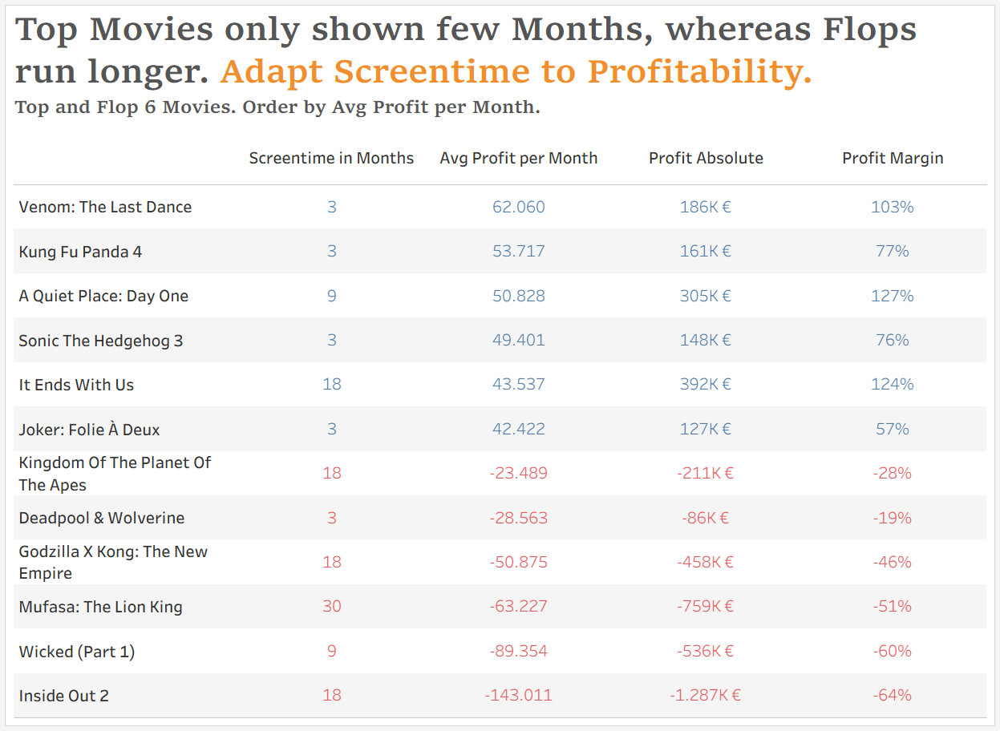

# Analytics Engineering: ETL - Pipeline with dbt, GitHub and Snowflake

> **For Recruiters:** An end-to-end dbt and Snowflake ETL pipeline, built on a medallion architecture with automated testing, feeding a Tableau dashboard that surfaced a real business problem hiding in messy raw data.

## Project Purpose

This curriculum project was a deep dive into building a robust, **production-ready Analytics Engineering pipeline**. It wasn't just about moving data-it was about transforming a complex, messy dataset into a single source of truth to answer a critical business question: Why is our movie theatre company losing money?

Using **data built tool (dbt) and Snowflake**, I designed, built, and tested a full ETL pipeline, delivering critical KPIs to assess the financial performance of movies across all locations. The key insights were finally visualized in a **Tableau dashboard**.

## Core Technologies & Stack

This project covers the modern data stack end to end:

* **Data Warehouse**: Snowflake, running as a cloud-native environment with schema management and COPY INTO ingestion.
* **Transformation & Orchestration**: dbt (data built tool), for model definition, testing, documentation, and orchestration.
* **Version Control**: Git and GitHub.
* **Visualization**: Tableau, for the final business performance dashboards.
* **Code Languages**: SQL, Jinja, and YAML.

## Key Analytics Engineering Accomplishments

Beyond writing queries, this project builds resilient and well-governed data assets:

* **Data Modeling**: A Medallion Data Model (Raw/Staging/Integration/Consumer) with 10+ dbt models to manage complexity and keep data lineage clear.

    

* **Data Quality & Testing**: Tested early and often with a mix of built-in dbt tests, custom self-made tests, and packages like dbt-utils and dbt-expectations, including uniqueness and not-null checks at the source and mart levels, plus custom tests such as not_negative for financial metrics (tickets_sold, revenue, costs).

* **Code DRYness & Reusability**: Jinja and dbt macros, essentially Python functions for SQL, cut down repetitive code and kept the logic manageable.

* **Cloud Ingestion**: Simulated a real-world scenario using Snowflake's COPY INTO feature to ingest raw data from managed cloud storage, standardizing schemas and column names along the way.

* **Documentation & Governance**: dbt generates structured, readable project documentation and data lineage automatically as part of development, not as an afterthought.

## Business Impact & Actionable Insights

The resulting data mart (mrt_movies_performance_incl_kpis) immediately exposed a real business problem:

| Insight | Visualization |
| --- | ---: |
| The company is operating at an overall loss over the analysed 12 months, driven primarily by two major locations. |  |
| Unprofitable movies were screened for up to 18 months, while profitable movies were rotated out again after only a few months. |  |
| Specific movie genres turned out to be highly unprofitable, accounting for a large share of total losses. |  |

**Recommendation**: focus on profitable genres, dig into why money-losing films keep getting screened, and extend the run of profitable titles to capture more of the demand while it's there.

Link to [Tableau Dashboard](https://public.tableau.com/app/profile/thorsten.weber/viz/movie_performance_FY24-25)

## Comprehensive Technical Project Description

The following passages are for the technically interested readers. You will find information about the data tools involved, steps and methods for data cleaning and transformation and testing of the models.

### Setup/ Tooling

This is not spectactular but technical setup is of course required
* Created new Snowflake environment
    * database and different schemas for development and production 
    * data storage for staging of raw data
    * data type for import of the csv files
* Created new dbt account in dbt cloud
    * connection to Snowflake
    * setting up two environments for dev and prod
    * integration with Github for version control
    * added test packages (dbt-utils, dbt-expectations)

This time I decided to work cloud native instead of dbt core local. I want to make use of the great data analysis features which are built in Snowflake for the EDA part of this project.

### Exploring the data

Within the initial exploratory data analysis (EDA) first anomalies showed already. Overall following anomalies exist. Many of them could be healed by different methods.

* missing values in various qualitative but also in numeric fields
* records for which no matching data can be found in others tables
* fully and partly duplicated data in invoices
* significantly high costs which cannot be compensated by revenue and create high losses

The methods for healing nearly of all them are described later in the paragraphs regarding the models and transformation and cleaning applied. Note: high costs cannot be healed. The reason needs to be investigated further.

### ETL-Pipeline: Ingestion in Snowflake

**The phase covers** a great feature of snowflake to directly connect to cloud storage providers and read in source files in various formats like csv or parquet. As this is the typical real-life scenario and we were given 5 CSV files I chose to simulate the cloud storage ingestion process, created a snowflake managed cloud storage and uploaded the csv files.

**Steps**:
* Identify columns required 
* DDL scripts to create schema `raw` as well as five `tables`
* Normalize and standardise column names and table names
* Use COPY INTO scripts to upload selected columns into tables

[code.sql](models/ingestation/load_raw_data.sql)

**Tests** applied: 
* not_null
* custom not_negative for tickets_sold, revenue and costs data
* custom test for accessing if date columns hold recent values
* unique test for movie_ids in movies source
* check for primary keys and foreign keys consistency across sources

### Transformation process using dbt

Use this lineage as a reference to better understand how the detailed models work together.

#### ETL-Pipeline: Staging 

The phase covers basic data type conversions and cleaning By convention there are no big transformations in this step. 

Applied **transformations and cleaning**:
* `stg_sales_cinema_01 and stg_sales_cinema_02`:
    * aggregate data on a monthly granularity
    * added feature to identify from which cinema the sales data comes from
* `stg_sales_cinema_03`:
    * data is already on monthly granularity. To safeguard the pipline still aggregation is applied if cinema three delivers data on daily level in the future
* `stg_movies`:
    * trim and initcap or upper for string columns for data quality
    * imputation of missing values with 'unknown' for string columns
    * identified missing values in movies_lenght not imputed, remains NULL in that case
* `stg_invoices`:
    * eliminated redundant invoice information
    * also applied trim and initcap for string columns
    * applied date_trunc(MONTH, ..) for invoice_date columns to prepare for monthly aggregation
    * extracted numeric values out of string columns (i.e. movie_budget and cinema_id)

**Tests** applied: Mainly not_null, a custom not_negative test and a custom test for accessing if date columns hold recent values. Additionally applied accepted_values for checken on correct cinema_ids.

#### ETL-Pipeline: Integration

* `int_movie_rental_costs`: Unioned all sales data from different movie theatres into one table.
* `int_movie_sales`: Joined invoice data with qualitative movie information from stg_movies

**Tests** applied: No tests applied due to data is not changed.

#### ETL-Pipeline: Consumer

Two models exist for the reason that both differ in granularity. One model has time-series data. The other model aggregates data on movie and cinema presenting KPIs to assess and compare the movies performance like avg_tickets_sold, total_profit and more.

* `mrt_movies_performance`: time-series data on monthly level
    * used full outer join for models int_movie_rental_costs with int_movie_sales
    * imputed missing values in int_movie_rental_costs with information from previous month information
    * added features screening_months_count and screening_duration_in_months required in later models
* `mrt_movies_performance_incl_kpis`: aggregated on movie and cinema
    * added features *first_month_on_screen*, calculated *total_brutto_profit* (i.e. revenue - rental_costs before infrastructure and personal)
    * added additional kpis for better movie performance comparison:
        * tickets_sold_per_month
        * movie_rental_costs_per_month
        * avg_brutto_profit
        * brutto_profit_percent (which is kind or a ROI)

**Tests** applied: Mainly not_null, not_negative or accepted_values on all fields to safeguard data quality at mart level.
